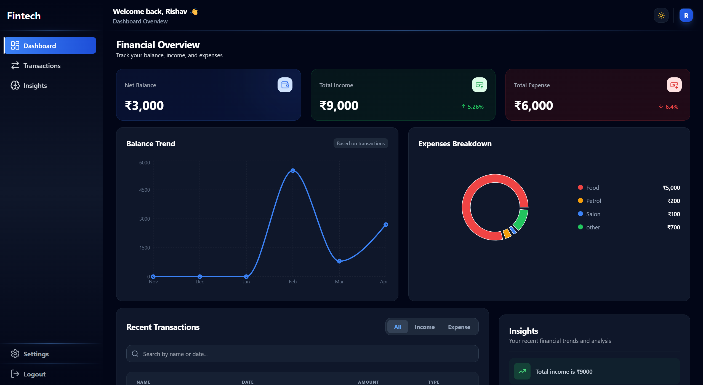
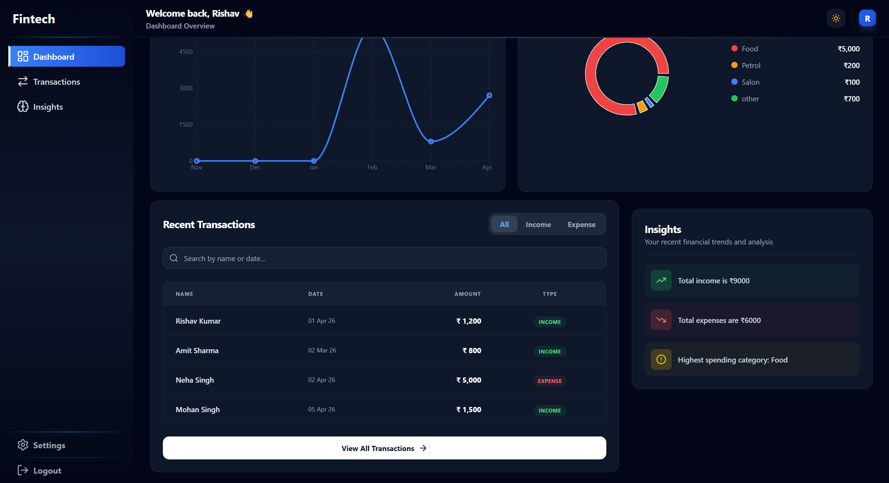
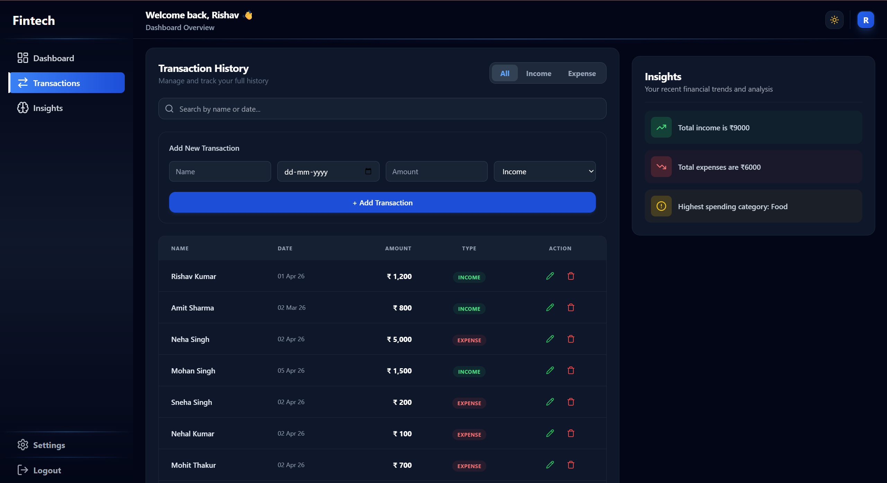
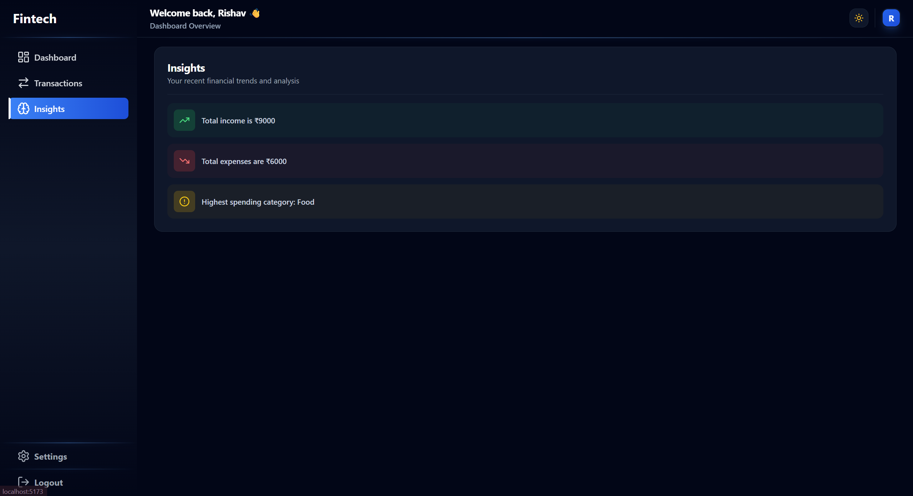

# 📊 Finance Dashboard (React)

A modern and responsive **Finance Dashboard Web App** built using React. This project helps users track their income, expenses, and overall financial summary with a clean and interactive UI.

---

## 🚀 Features

### 🧱 Core Layout

- Responsive **Sidebar Navigation**
- Clean and minimal **Top Navbar**
- Fully **Responsive Design** (Mobile, Tablet, Desktop)

---

### 📊 Dashboard Overview

- 💰 Total Balance Card
- 📈 Total Income Card
- 📉 Total Expenses Card
- Clean and structured financial overview

---

### 💸 Transactions Module

- 📄 Transaction Table with:
  - Name
  - Date
  - Amount
  - Type (Income / Expense)

- ✏️ Edit and Delete actions (UI ready)
- 🔍 Search and filtering UI
- 📊 Data slicing / pagination logic

---

### 📈 Insights Page

- Dedicated Insights section
- Structured for future chart integration
- Scalable for analytics features

---

### 🎨 UI / UX

- 🌙 Dark Mode & ☀️ Light Mode support
- Smooth hover effects and transitions
- Modern card-based layout using Tailwind CSS
- Clean typography and spacing

---

### ⚡ Performance & Experience

- Optimized component structure
- Fast rendering using React
- (Planned) Skeleton loading for better UX
- (Planned) Animations for smoother interaction

---

## 🧭 Routing

- `/` → Dashboard
- `/transactions` → Transactions Page
- `/insights` → Insights Page

---

## 🛠️ Tech Stack

- **Frontend:** React.js
- **Styling:** Tailwind CSS
- **Routing:** React Router
- **Icons:** Lucide React

---

## 📂 Project Structure

```
src/
│── components/
│   ├── Sidebar.jsx
│   ├── Navbar.jsx
│   ├── SummaryCard.jsx
│   ├── TransactionTable.jsx
│   ├── Insights.jsx
│
│── pages/
│   ├── Dashboard.jsx
│   ├── Transactions.jsx
│   ├── Insights.jsx
│
│── App.jsx
│── main.jsx
```

---

## 📱 Responsiveness

- Mobile-first design
- Optimized layouts for:
  - Small screens 📱
  - Tablets 📲
  - Large screens 💻

---

## 🎯 Future Improvements

- 📊 Add charts (Bar / Pie / Line)
- 🌐 Backend integration (Node.js + MongoDB)
- 🔐 Reintroduce authentication with JWT
- ⚡ Add skeleton loaders
- ✨ Add animations for better UX

---

## 📸 Preview

### DASHBOARD

<p align="center">
  
    
</p>

### TRANSACTIONS

<p align="center">
  
</p>

### insights

<p align="center">
  
</p>

---

## 🧑‍💻 Author

**Rishav Kumar**

---

## ⭐ If you like this project

Give it a ⭐ on GitHub and feel free to fork it!

---
